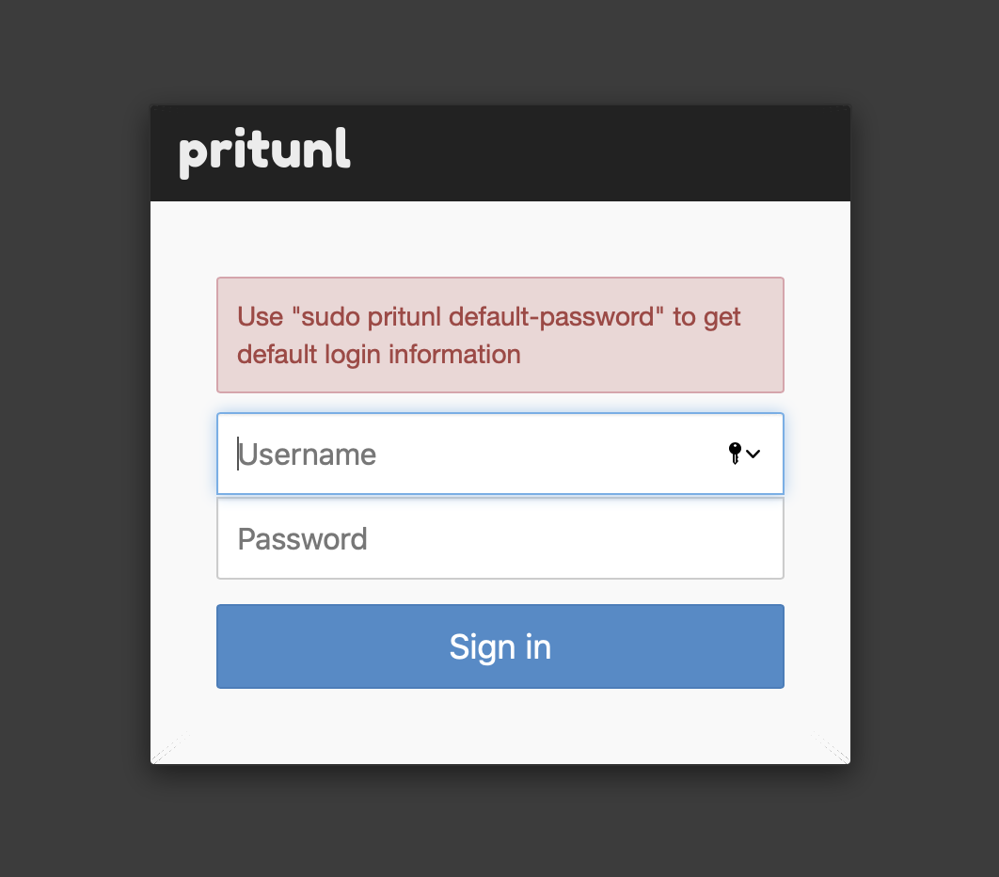

# pritunl-vpn-setup-automation
Bash + terraform scripts to automate standing up pritunl VPN servers.

FYI: Each instance stood up is an Ubuntu 20 DigitalOcean instance.

The scripts were built to be run on either Linux or macOS hosts. The scripts will first check to see if you have installed terraform and if not, it will attempt to install it for you before proceeding.

**NOTE: It is recommended that after running any of the scripts below to stand up your infra that you then ssh into your host, create a local user with sudo, and run any tools as that user. Running tools as root is not recommended**

## Prerequisites

- homebrew (macOS)

- curl

- You will need to setup a DigitalOcean API key (can be done via the web admin console page). Terraform uses your DO API key in order to interface with DO.

- You will also need to set up an ssh key in DigitalOcean (which will be used by terraform to log into the droplet)

## Instructions

> cd DigitalOcean_Setup/

> chmod +x *.sh

> ./DO-pritunl-vpn-setup.sh

#### This will setup an ubuntu host in DigitalOcean, create a firewall, and add this host behind the firewall so that only the provided IP can access ssh, http, and https on the newly stood up pritunl vpn server.

This bash script will gather info such as:
- what you want to name your new droplet, 
- the src IP (or range) you want to use to login to the droplet (this will restrict access to port 22, 443, and 80 to this IP). 
- the name of your DO ssh key (you can set this up in your DO control panel in the admin console web page),
- the local path to your ssh private key that you use to ssh into DigitalOcean (will be used by terraform to login and install tools once the image is built)

Terraform will then install the following in the DO droplet:

- curl

- ufw firewall (and configure it)

- pritunl

- mongodb-server

**once done, you will see a message from terraform indicating succcess:**

Next, you can browse to the newly stood up pritunl droplet. You will see the page below asking for a setup key:

**on the pritunl server, run the following command to obtain the key, enter it, and then click the Save button:

> sudo pritunl setup-key

Next, you will be brought to a page asking for pritunl login creds:

**on the pritunl server, run the following command to obtain the creds, enter them, and then click the Sign in button:

> sudo pritunl default-password

At this point you are now set up and logged into pritunl and can set up the VPN as you please. Just keep in mind that once you start the VPN server, you will need to add ufw firewall rules accordinly on the pritunl VPN server to allow access to that port from restricted IP space.
